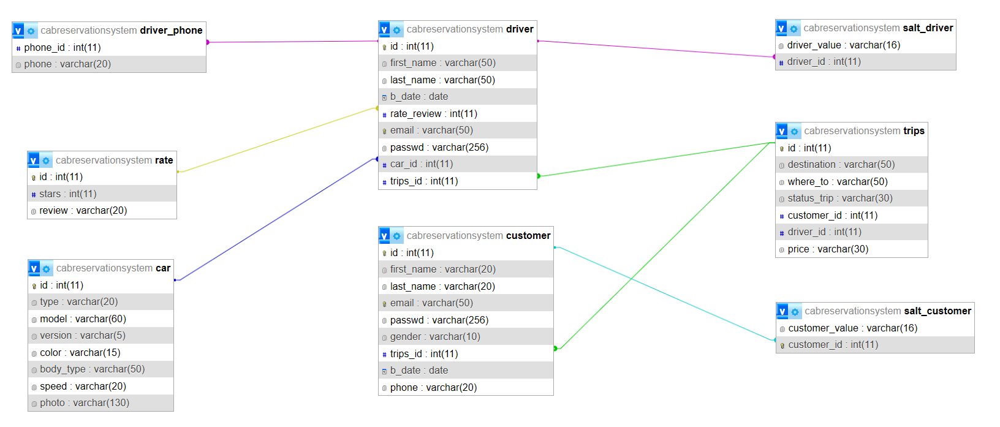

# FineCab
FineCab is an cab reservation system designed to streamline the process of booking and managing rides. The project features client and driver interfaces, offering a user-friendly experience for both parties. Developed using Java and MySQL, FineCab ensures robust performance and data management. Security is a top priority, with user passwords secured using a combination of salt and the SHA-256 hashing algorithm, providing a high level of protection against unauthorized access.

## EDR of the SQL DB

---
Author : Ahmed Shawki
---
